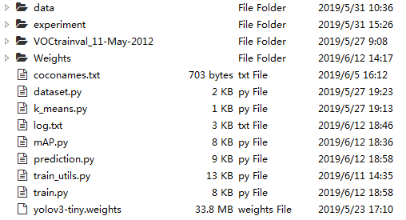

# Yolo-v3-tiny-train
train tiny-yolo-v3 for your own dataset

### Important reference: 
http://machinethink.net/blog/object-detection/; 

https://github.com/wizyoung/YOLOv3_TensorFlow; 

https://github.com/YunYang1994/tensorflow-yolov3/blob/master/core/yolov3.py

I learned a lot from the blog. It's fantastic and very suitable for beginners to know about yolo and its training. But during my own implementation i found there are two mistakes in the blog that will greatly influence yolo's training:
1. yolo uses warm-up during training, but the purpose is to let the model learn with a small rate in the begining, to avoid gradient explosion, not to 'encourage predictions to start matching the anchors for the detectors'. And if you do as the blog says, i.e., 'adding a fake ground-truth box in the center of each cell during early training steps', you will have great difficulty in reducing the loss.
2. yolo-v2 uses scale parameter to balance the influence of different losses, but yolo-v3 doesn't adopt such strategy. According to my own experience, whether adding focal loss has little effect on its performance. Besides, data-augmentation is very important for getting good results.

### Function of the files:
1. 'dataset.py': preprocess the raw data. I train yolo for the voc dataset so the function is designed for this specifically. The output of the file is [[class, {xmin: , xmax: , ymin: , ymax: }], [W, H]].
2. 'k-means.py': with the processed dataset as input, calculate prior anchors using k-means.
3. 'prediction.py': convert weights file from darknet and store it as .ckpt file, for preparation for the subsequent training.
4. 'train_utils.py': various functions that will be used during the training process.
5. 'train.py': run this file to train yolo. There are lots of hyperparameters and may need to be modified according to your own dataset.

The layout of the files is shown below:

### Parameters setting:

After experimenting with several groups of hyperparameters, i found that desirable results can be obtained with: 

--initial learning rate = 2e-4; 
 
--focal loss parameter: alpha = 1, gamma = 2; 
 
--epoch_num: warm-up: 2, first-stage: 3, second-stage: 100. 
 
The model is trained on the VOC 2007+2012 trainval dataset and gets an mAP of 53.10 on the test dataset of VOC 2007. The model's performance can be improved by adjusting parameters carefully, but such improvement is little (since the structure is too simple (only 7 conv layers in 'body'), which means the capacity of the net is low and the net is underfitting). 

### Results:

Some of the test results are shown below (with conf_threshold = 0.5 and iou_threshold = 0.5):

The detection results are much better than the those in my yolo-v3 repo (because of the different upsample methods between tf and darknet probably, see it in detail in my repo). 

Note it again that the model's performance can still be improved by adjusting parameters carefully, using multi-scale training and data augmentation.
